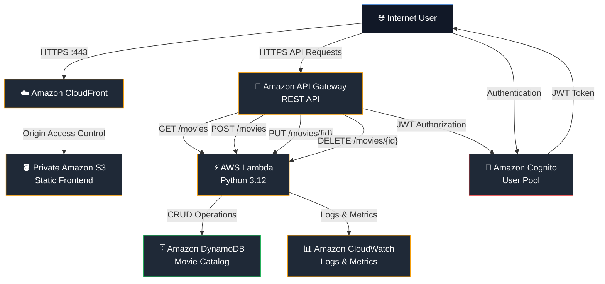
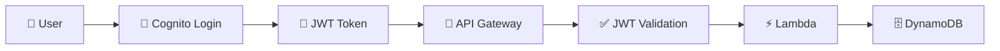
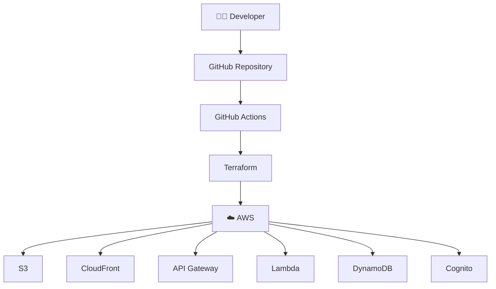
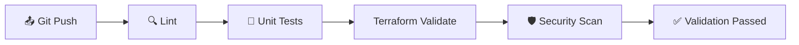
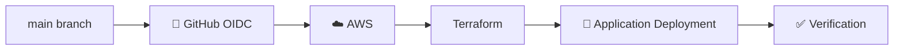

# 🎬 Cineverse — Production-Inspired Serverless AWS Application

<p align="center">
  <strong>Modern • Secure • Scalable • Serverless • Cloud-Native</strong>
</p>

<p align="center">
  A production-inspired movie catalog application built on AWS using a modern serverless 3-tier architecture, Infrastructure as Code, authentication, CI/CD, security controls, and operational best practices.
</p>

<p align="center">


</p>

---

## 📌 Table of Contents

- [Architecture Overview](#-architecture-overview)
- [Architecture Diagram](#-architecture-diagram)
- [Traffic Flow](#-traffic-flow)
- [Repository Structure](#-repository-structure)
- [Security & Best Practices](#-security--best-practices)
- [Technology Stack](#-technology-stack)
- [API Design](#-api-design)
- [Data Model](#-data-model)
- [Deployment Architecture](#-deployment-architecture)
- [Step-by-Step Deployment](#-step-by-step-deployment)
- [CI/CD Pipeline](#-cicd-pipeline)
- [Testing & Validation](#-testing--validation)
- [Monitoring & Operations](#-monitoring--operations)
- [Cost Estimation](#-cost-estimation)
- [Limitations](#-limitations)
- [Roadmap](#-roadmap)
- [License](#-license)

---

# 🏛️ Architecture Overview

Cineverse follows a modern **AWS serverless 3-tier architecture** designed around scalability, security, low operational overhead, and Infrastructure as Code.

### Frontend Layer

The frontend is a static web application hosted in a **private Amazon S3 bucket** and delivered globally through **Amazon CloudFront**.

### API Layer

The application exposes REST APIs through **Amazon API Gateway**.

Public read operations are available for movie retrieval, while write operations require authentication through **Amazon Cognito**.

### Compute Layer

Business logic is implemented using **AWS Lambda with Python 3.12**.

Lambda performs:

- Request validation
- Authentication handling
- Movie CRUD operations
- Input sanitization
- DynamoDB interaction
- Logging
- Error handling

### Data Layer

Movie information is stored in **Amazon DynamoDB** using a serverless NoSQL architecture.

Point-in-Time Recovery is enabled to improve data protection.

---

# 🧩 Architecture Diagram



---

# 🔄 Traffic Flow

| Step | Source | Destination | Protocol / Port | Purpose |
|---:|---|---|---|---|
| 1 | Internet User | CloudFront | HTTPS :443 | Secure frontend access |
| 2 | CloudFront | Private S3 | HTTPS | Static frontend delivery |
| 3 | Browser | API Gateway | HTTPS :443 | REST API requests |
| 4 | API Gateway | Lambda | AWS Internal | Backend execution |
| 5 | Lambda | DynamoDB | AWS Internal | Database operations |
| 6 | Browser | Cognito | HTTPS | User authentication |
| 7 | Lambda | CloudWatch | AWS Internal | Logs and metrics |

---

# 🗂️ Repository Structure

```text
cineverse-serverless-app/
│
├── .github/
│   └── workflows/
│       ├── ci.yml
│       └── deploy.yml
│
├── backend/
│   ├── lambda_function.py
│   └── requirements.txt
│
├── frontend/
│   ├── index.html
│   ├── config.js
│   └── config.example.js
│
├── infrastructure/
│   ├── main.tf
│   ├── variables.tf
│   └── outputs.tf
│
├── tests/
│   └── unit/
│       └── test_lambda.py
│
├── .gitignore
├── CHANGELOG.md
├── CONTRIBUTING.md
├── LICENSE
├── README.md
└── SECURITY.md
```

---

# 🔐 Security & Best Practices

Security is treated as a first-class component of the architecture.

| Category | Implementation |
|---|---|
| Frontend Security | Private S3 bucket |
| CDN Security | CloudFront Origin Access Control |
| Transport Security | HTTPS-only access |
| Authentication | Amazon Cognito User Pool |
| API Authorization | JWT-based authorization |
| Input Validation | Server-side validation |
| Secrets | GitHub OIDC + environment configuration |
| IAM | Least-privilege Lambda role |
| Database Security | DynamoDB encryption at rest |
| Data Recovery | Point-in-Time Recovery |
| Monitoring | CloudWatch Logs & Metrics |
| CI Security | Automated security scanning |

---

# 🔒 Authentication & Authorization

Cineverse uses **Amazon Cognito** for user authentication.

### Public Operation

```text
GET /movies
```

Users can retrieve movie information without performing an authenticated write operation.

### Protected Operations

```text
POST /movies
PUT /movies/{id}
DELETE /movies/{id}
```

These operations require a valid Cognito-issued JWT.

The API validates the token before allowing protected operations.

---

# 🛡️ API Authorization Model



---

# 🚪 API Design

| Method | Endpoint | Authentication | Purpose |
|---|---|---|---|
| GET | `/movies` | Public | Retrieve all movies |
| GET | `/movies/{id}` | Public | Retrieve movie by ID |
| POST | `/movies` | Required | Create a movie |
| PUT | `/movies/{id}` | Required | Update a movie |
| DELETE | `/movies/{id}` | Required | Delete a movie |

---

# 🎬 Movie Data Model

Example movie object:

```json
{
  "id": "movie-001",
  "name": "Example Movie",
  "rating": 8.5,
  "year": 2026
}
```

### Supported Fields

| Field | Type | Description |
|---|---|---|
| `id` | String | Unique movie identifier |
| `name` | String | Movie name |
| `rating` | Number | Movie rating |
| `year` | Number | Release year |

Server-side validation is applied before database insertion or updates.

---

# ⚙️ Backend Architecture

The backend is implemented using:

- Python 3.12
- AWS Lambda
- API Gateway
- DynamoDB
- Amazon Cognito
- CloudWatch

Lambda is responsible for:

```text
Request
   ↓
Validation
   ↓
Authentication Check
   ↓
Business Logic
   ↓
DynamoDB Operation
   ↓
Response
   ↓
CloudWatch Logging
```

---

# 🏗️ Infrastructure as Code

The complete AWS infrastructure is defined using **Terraform**.

Terraform manages:

- S3
- CloudFront
- API Gateway
- Lambda
- DynamoDB
- Cognito
- IAM
- CloudWatch
- Supporting resources

This makes infrastructure:

- Reproducible
- Version controlled
- Reviewable
- Automated
- Consistent across environments

---

# ☁️ Deployment Architecture



---

# 🚀 Step-by-Step Deployment

## 1. Clone the Repository

Clone the repository locally and open the project directory.

## 2. Configure AWS

Configure AWS credentials for local Terraform operations.

For CI/CD, use GitHub Actions with **OIDC-based AWS authentication** instead of storing long-lived AWS access keys.

## 3. Configure Terraform Variables

Review:

```text
infrastructure/variables.tf
```

Set the required environment-specific values.

## 4. Initialize Terraform

From the infrastructure directory, initialize Terraform.

```text
terraform init
```

## 5. Validate Configuration

```text
terraform validate
```

## 6. Review Infrastructure Changes

```text
terraform plan
```

## 7. Deploy Infrastructure

```text
terraform apply
```

## 8. Deploy Frontend

Upload the frontend assets to the provisioned S3 bucket.

CloudFront then serves the application globally.

## 9. Configure Frontend API Endpoint

Update the frontend configuration with the API Gateway endpoint generated by Terraform.

---

# 🔁 CI/CD Pipeline

The project includes GitHub Actions workflows for automated validation and deployment.

### CI Pipeline



### Deployment Pipeline



---

# 🧪 Testing & Validation

Unit tests are located under:

```text
tests/unit/
```

The project uses:

- pytest
- mocks
- Terraform validation
- linting
- security scanning

Recommended validation flow:

```text
Lint
  ↓
Unit Tests
  ↓
Terraform Validate
  ↓
Security Scan
  ↓
Deployment
```

---

# 📊 Monitoring & Operations

Amazon CloudWatch provides operational visibility into the Lambda backend.

Monitoring can include:

- Lambda invocation count
- Lambda errors
- Lambda duration
- API errors
- Application logs
- DynamoDB activity
- Operational alarms

Centralized logging makes troubleshooting easier without managing traditional servers.

---

# 💰 Cost Estimation

The architecture is designed around AWS serverless services, which means infrastructure cost is primarily usage-based.

Main cost drivers include:

| Service | Primary Cost Driver |
|---|---|
| CloudFront | Data transfer / requests |
| S3 | Storage / requests |
| API Gateway | API requests |
| Lambda | Invocations / compute duration |
| DynamoDB | Read/write capacity or on-demand usage |
| Cognito | Monthly active users / authentication usage |
| CloudWatch | Logs / metrics |

Actual cost depends on:

- Traffic
- Number of API requests
- Lambda execution time
- Database usage
- Frontend data transfer
- Number of authenticated users

For a low-traffic portfolio application, serverless architecture can keep infrastructure overhead relatively low.

---

# 🧠 Why Serverless?

Cineverse uses serverless architecture to avoid managing traditional application servers.

### Benefits

- Automatic scaling
- No server provisioning
- Pay-per-use model
- Reduced infrastructure management
- Built-in AWS availability
- Easy automation
- Strong integration with AWS services

---

# ⚠️ Limitations

This project is production-inspired but should not automatically be considered a fully production-hardened enterprise system.

Potential areas for further improvement include:

- Advanced API throttling
- WAF integration
- Multi-environment infrastructure
- Custom domain configuration
- Automated database migrations
- Advanced observability
- Distributed tracing
- Disaster recovery strategy
- Automated integration testing
- Enhanced application-level rate limiting

---

# 🗺️ Roadmap

### Phase 1 — Foundation

- [x] Serverless architecture
- [x] Terraform infrastructure
- [x] Lambda backend
- [x] DynamoDB
- [x] API Gateway
- [x] Cognito authentication
- [x] CloudFront frontend
- [x] CI/CD foundation

### Phase 2 — Security

- [x] Private S3
- [x] CloudFront OAC
- [x] HTTPS-only access
- [x] JWT authorization
- [x] Least-privilege IAM
- [x] Input validation

### Phase 3 — Operations

- [x] CloudWatch logging
- [x] Automated testing
- [x] Terraform validation
- [x] Security scanning

### Phase 4 — Future Enhancements

- [ ] AWS WAF
- [ ] Custom domain
- [ ] Route 53 integration
- [ ] Advanced monitoring dashboards
- [ ] Distributed tracing
- [ ] Multi-environment deployment
- [ ] Blue/Green deployment
- [ ] Automated rollback

---

# 📚 Technology Stack

| Layer | Technology |
|---|---|
| Frontend | HTML / JavaScript |
| CDN | Amazon CloudFront |
| Storage | Amazon S3 |
| API | Amazon API Gateway |
| Authentication | Amazon Cognito |
| Compute | AWS Lambda |
| Backend | Python 3.12 |
| Database | Amazon DynamoDB |
| Monitoring | Amazon CloudWatch |
| Infrastructure | Terraform |
| CI/CD | GitHub Actions |
| Security | IAM / OIDC / JWT |
| Testing | pytest |

---

# 🎯 Project Goals

Cineverse demonstrates how a modern application can combine:

**Cloud Architecture**

→ Serverless AWS services  
→ Infrastructure as Code  
→ Automated deployment  

**Security**

→ Cognito authentication  
→ JWT authorization  
→ Least-privilege IAM  
→ Private S3  
→ CloudFront OAC  

**Engineering**

→ Input validation  
→ Unit testing  
→ CI/CD  
→ Monitoring  
→ Reproducible infrastructure  

---

# 👨‍💻 Engineering Principles

This project follows these core principles:

### 🔹 Infrastructure as Code

Infrastructure should be reproducible and version controlled.

### 🔹 Least Privilege

AWS IAM permissions should grant only the access required by each component.

### 🔹 Secure by Default

Private storage, HTTPS, authentication, and server-side validation are preferred wherever practical.

### 🔹 Automation First

Testing, validation, security scanning, and deployment should be automated.

### 🔹 Observability

Application activity should be visible through centralized logging and metrics.

### 🔹 Serverless First

Use managed AWS services wherever they reduce operational complexity.

---

# 📄 License

This project is licensed under the **MIT License**.

See the `LICENSE` file for complete license information.

---

# ⭐ Project Summary

**Cineverse** is a production-inspired AWS serverless application demonstrating how a modern cloud-native system can be designed using:

**CloudFront + S3 + API Gateway + Cognito + Lambda + DynamoDB + CloudWatch + Terraform + GitHub Actions**

The architecture emphasizes:

> **Security • Scalability • Automation • Maintainability • Low Operational Overhead**

---

<p align="center">
  <strong>🎬 Cineverse</strong><br>
  Production-Inspired Serverless AWS Architecture
</p>