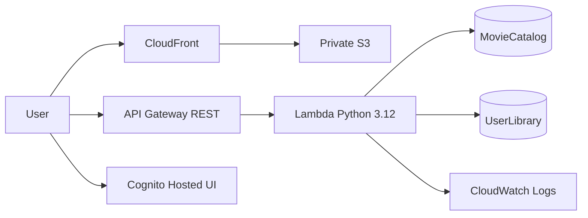
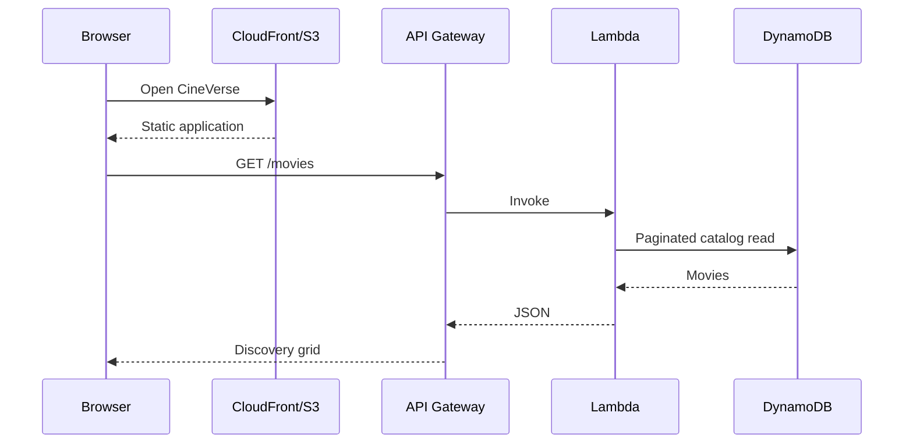
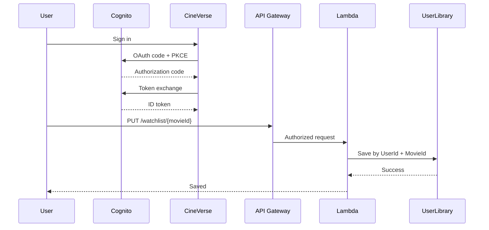

# 🎬 CineVerse

> **Discover. Save. Rewatch.**

CineVerse is a premium serverless movie discovery platform that preserves the original movie-catalog goal while upgrading the product experience, authentication, persistence, security and AWS architecture.

[](https://github.com/Ibad84671/cineverse-serverless-app/actions/workflows/ci.yml)   

## ✨ Product experience

- Cinematic dark interface with a focused CineVerse design system
- Responsive movie cards with poster fallbacks, ratings and metadata
- Search with debounce and genre/year/rating/sort filters
- Movie detail dialog with overview and metadata
- Pagination-aware catalog loading
- Real Cognito Hosted UI sign-in using Authorization Code + PKCE
- Persistent per-user watchlist
- Owner/admin authorization for catalog mutations
- Honest loading, empty and failure states
- Keyboard `/` search shortcut and reduced-motion support

Recommendations remain intentionally transparent: the current experience uses catalog metadata, quality and recency signals rather than claiming a fake AI engine.

## ☁️ AWS architecture



### Request flow



### Authentication + watchlist



## 🧩 AWS services

| Service | Purpose |
|---|---|
| S3 | Private static frontend origin |
| CloudFront | HTTPS delivery + Origin Access Control |
| API Gateway REST | Public/protected API surface |
| Lambda | Validation, authorization and business logic |
| DynamoDB | Movie catalog + user watchlists |
| Cognito | Authentication and JWT issuance |
| IAM | Least-privilege Lambda access |
| CloudWatch | API access and Lambda logs |
| CloudFormation | Complete infrastructure source of truth |

## 🔌 API

| Method | Route | Auth | Purpose |
|---|---|---|---|
| GET | `/movies` | Public | Paginated catalog |
| GET | `/movies/{movie_id}` | Public | Movie details |
| POST | `/movies` | Cognito | Create movie |
| PUT | `/movies/{movie_id}` | Cognito | Owner/admin update |
| DELETE | `/movies/{movie_id}` | Admin | Delete movie |
| GET | `/watchlist` | Cognito | Current user's saved films |
| PUT | `/watchlist/{movie_id}` | Cognito | Save film |
| DELETE | `/watchlist/{movie_id}` | Cognito | Remove film |

## 📁 Repository

```text
cineverse-serverless-app/
├── .github/workflows/
│   ├── ci.yml
│   └── deploy.yml
├── backend/
│   ├── lambda_function.py
│   ├── requirements.txt
│   └── requirements-dev.txt
├── docs/
├── frontend/
│   ├── index.html
│   ├── styles.css
│   ├── app.js
│   ├── config.js
│   └── config.example.js
├── infrastructure/
│   └── cineverse-v2.yaml
├── scripts/
│   ├── deploy.sh
│   └── deploy.ps1
├── tests/unit/test_lambda.py
├── SECURITY.md
├── CONTRIBUTING.md
├── CHANGELOG.md
└── README.md
```

CloudFormation is the only infrastructure source of truth. Terraform has been retired rather than maintaining competing IaC definitions.

## 🚀 One-command deployment

### Prerequisites

- AWS CLI v2
- An AWS identity allowed to deploy the stack
- Bash/Git Bash or PowerShell

### Bash

```bash
export AWS_REGION=us-east-1
./scripts/deploy.sh
```

### PowerShell

```powershell
$env:AWS_REGION = "us-east-1"
.\scripts\deploy.ps1
```

The scripts validate CloudFormation, deploy the stack, read outputs, generate `frontend/config.js`, publish the frontend to private S3 and invalidate CloudFront.

The Cognito domain prefix defaults to `cineverse-<AWS-account-id>` so it is deterministic per account without committing a secret.

## 🔐 Authentication

CineVerse uses a Cognito public web client and OAuth 2.0 Authorization Code + PKCE. The browser never receives a Cognito client secret and never manufactures a fake authentication token. The API is protected by a Cognito user-pool authorizer.

Catalog reads are public. Movie creation, updates and watchlist operations require authentication. Deletes require the `admins` Cognito group.

## 🛡 Security

- S3 public access is blocked; CloudFront OAC is the read path.
- DynamoDB is encrypted and protected with point-in-time recovery.
- Lambda has only the DynamoDB and CloudWatch permissions it needs.
- Cross-user watchlist access is prevented by the Cognito `sub` partition key.
- Movie updates enforce owner-or-admin authorization in Lambda.
- Client-rendered movie metadata is escaped before insertion into HTML.
- No AWS credentials or private movie API keys are committed.
- CI includes CodeQL, Gitleaks and Checkov.

## ⚡ Performance

The frontend uses lazy poster loading, debounced search, pagination, efficient filtering and minimal JavaScript dependencies. CloudFront provides compression and caching. DynamoDB uses pay-per-request capacity.

## 🧪 Validation

```bash
pip install -r backend/requirements.txt -r backend/requirements-dev.txt
pytest tests/unit/ -v --cov=backend --cov-report=term-missing
flake8 backend/lambda_function.py --max-line-length=120 --ignore=E501,F403,F405,W503
cfn-lint infrastructure/cineverse-v2.yaml
```

GitHub Actions additionally runs frontend sanity checks, CodeQL, Gitleaks and Checkov CloudFormation analysis.

## 💰 Cost awareness

CineVerse uses usage-based serverless services and DynamoDB on-demand capacity. CloudFront is configured with `PriceClass_100`; CloudWatch logs default to a 14-day retention period. Actual cost depends on traffic, API requests, Lambda duration, data transfer, logs, storage and authentication usage. Serverless is not automatically free.

## 🧹 Cleanup

Review retained data before deleting the stack:

```bash
aws cloudformation delete-stack --stack-name cineverse-prod --region us-east-1
```

S3 and DynamoDB use `Retain` policies so stack deletion does not automatically destroy application data.

## ⚠️ Known limitations

- The catalog is the application's own DynamoDB dataset; there is no hidden third-party movie API dependency.
- Recommendations are metadata/quality-driven, not machine learning.
- The default deployment uses the CloudFront hostname rather than a custom domain.
- A larger public workload may warrant AWS WAF, stricter throttling, custom domains, multi-environment promotion and deeper observability.

## 📚 Documentation

- [Architecture](docs/architecture.md)
- [Deployment](docs/deployment.md)
- [Security](docs/security.md)
- [Operations](docs/operations.md)
- [Contributing](CONTRIBUTING.md)
- [Security policy](SECURITY.md)

## License

MIT — see [LICENSE](LICENSE).
