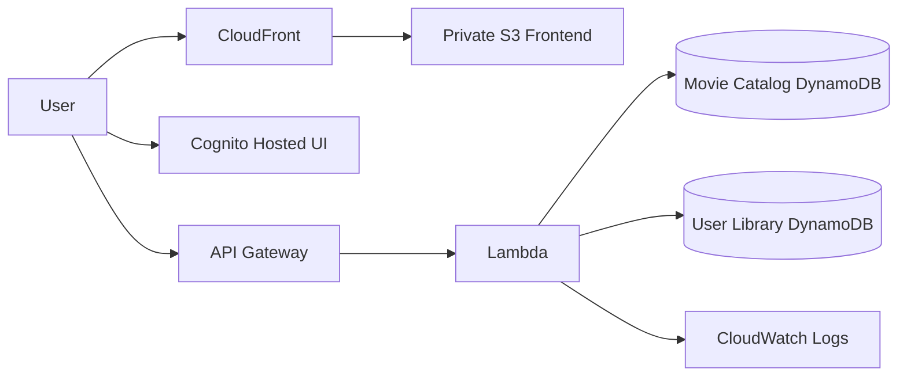

# 🎬 CineVerse

**Discover. Save. Rewatch.**

A premium serverless movie discovery platform built on AWS, combining a cinematic responsive interface with real cloud-backed catalog, authentication and personal watchlist features.


## ✨ What CineVerse Does

- 🎬 Browse and discover movies through a cinematic, responsive UI
- 🔎 Search, filter and sort the movie catalog
- ⭐ Explore ratings, genres, metadata and movie details
- ♡ Save movies to a persistent personal watchlist
- 🔐 Optional secure authentication with Amazon Cognito
- ☁️ Run the application on AWS serverless services
- 🏗️ Provision the deployment architecture with AWS CloudFormation
- 🛡️ Apply least-privilege IAM, API authorization and security checks

## ☁️ Architecture



The infrastructure source of truth is `infrastructure/cineverse-v2.yaml`. The frontend is delivered through CloudFront from a private S3 origin, while API Gateway routes requests to focused Lambda logic backed by DynamoDB.

## 🧱 Tech Stack

| Layer | Technology |
|---|---|
| Frontend | HTML, CSS, Vanilla JavaScript |
| CDN / Web delivery | Amazon CloudFront + Amazon S3 |
| API | Amazon API Gateway |
| Compute | AWS Lambda + Python |
| Database | Amazon DynamoDB |
| Authentication | Amazon Cognito + OAuth 2.0 PKCE |
| Infrastructure | AWS CloudFormation |
| Observability | Amazon CloudWatch |
| CI | GitHub Actions |

## 📁 Repository

```text
cineverse-serverless-app/
├── frontend/                 # CineVerse web experience
├── backend/                  # Lambda handlers and backend tests
├── infrastructure/           # CloudFormation infrastructure
├── scripts/                  # Deployment and validation helpers
├── docs/                     # Architecture, security and deployment docs
├── tests/                    # Project-level validation
├── .github/workflows/        # CI/CD and security checks
├── README.md
├── SECURITY.md
├── CONTRIBUTING.md
└── LICENSE
```

## 🚀 Deployment

CineVerse is designed so the AWS infrastructure can be recreated from CloudFormation rather than relying on undocumented console configuration.

### Prerequisites

- AWS account
- AWS CLI configured with suitable deployment permissions
- Python 3.12+
- Bash or PowerShell
- A Cognito callback URL and movie data configuration where required

### Validate

```bash
./scripts/validate.sh
```

PowerShell users can use the matching `.ps1` scripts in `scripts/`.

### Deploy

```bash
./scripts/deploy.sh
```

The deployment script validates the CloudFormation template, deploys the stack, waits for completion and reports the resulting outputs.

> Never commit AWS credentials, Cognito secrets, API keys or other sensitive values. Use environment variables or AWS-managed identity/secrets mechanisms as documented in `docs/`.

## 🔐 Security

Security is part of the architecture rather than an afterthought. The project includes authenticated API operations, least-privilege IAM policies, private S3 origin access through CloudFront, input validation, secure Cognito PKCE authentication and automated security checks.

See [SECURITY.md](SECURITY.md) for reporting guidance and [docs/security.md](docs/security.md) for implementation details.

## 🧪 Quality & CI

GitHub Actions validates the project with application checks, infrastructure validation and security tooling. The repository is intentionally configured to fail on meaningful quality or security regressions instead of using placeholder tests solely to produce green builds.

## 💰 Cost Awareness

CineVerse uses managed/serverless AWS services to avoid always-on compute. Actual cost depends on traffic, CloudFront data transfer, Lambda/API usage, DynamoDB usage, CloudWatch logs and Cognito usage. Always review current AWS pricing and set appropriate budgets/alerts for real deployments.

## 📚 Documentation

- [Architecture](docs/architecture.md)
- [Deployment](docs/deployment.md)
- [API](docs/api.md)
- [Authentication](docs/authentication.md)
- [Recommendations](docs/recommendations.md)
- [Security](docs/security.md)
- [Development](docs/development.md)
- [Troubleshooting](docs/troubleshooting.md)

## 🤝 Contributing

See [CONTRIBUTING.md](CONTRIBUTING.md) for the development workflow and contribution standards.

## 📄 License

Released under the MIT License. See [LICENSE](LICENSE).

---

**CineVerse** — a cloud-native movie discovery project designed to demonstrate practical AWS serverless engineering without unnecessary infrastructure complexity.
