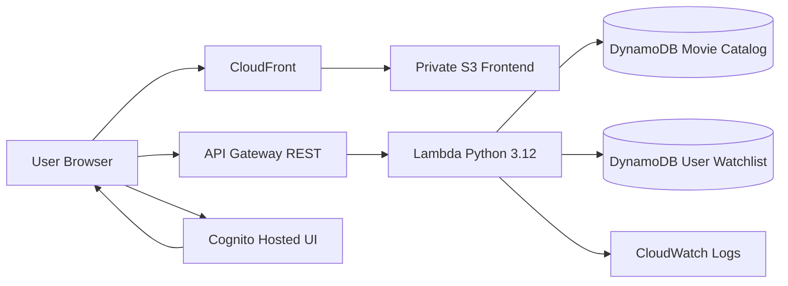
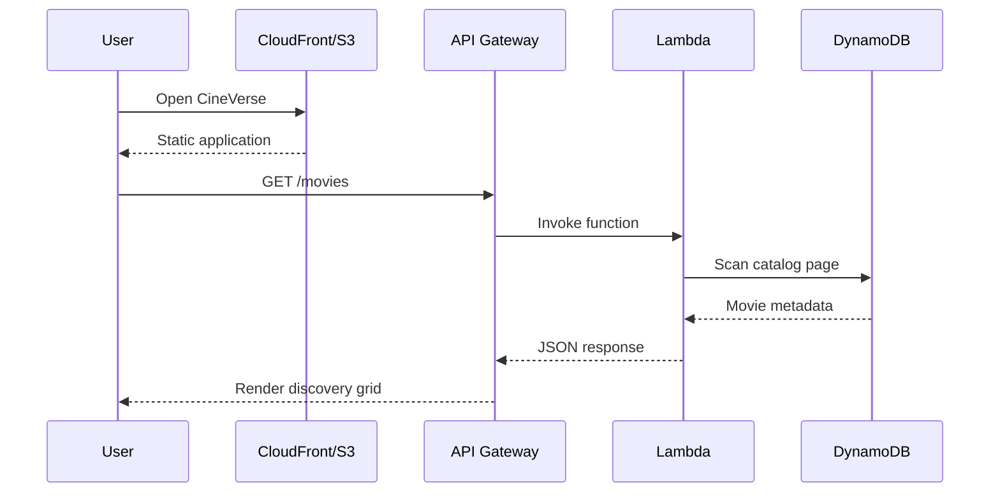
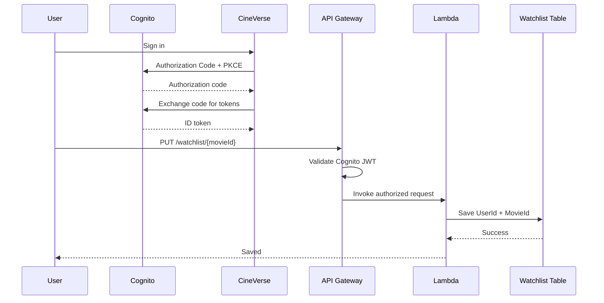

# 🎬 CineVerse

> **Discover. Save. Rewatch.**
>
> A premium, serverless movie discovery platform built on AWS — with a cinematic frontend, real Cognito authentication, persistent watchlists, DynamoDB, API Gateway, Lambda, CloudFront and CloudFormation.

[](https://github.com/Ibad84671/cineverse-serverless-app/actions/workflows/ci.yml) [](https://aws.amazon.com/serverless/) [](https://aws.amazon.com/cloudformation/) [](LICENSE)

## What CineVerse is

CineVerse keeps its original movie-catalog purpose but turns it into a polished discovery experience. Users can browse a catalog, search and filter titles, inspect cinematic details, sort by rating/year/title, and optionally sign in to persist a personal watchlist.

The recommendation experience is intentionally lightweight and transparent: discovery is driven by the catalog's genre, rating, year and metadata rather than an overstated “AI” claim.

## ✨ Highlights

- Cinematic dark UI with a dedicated CineVerse design system
- Responsive movie cards and accessible movie-detail dialog
- Search with debounce plus genre/year/rating/sort filters
- Pagination support for large DynamoDB catalogs
- Real Amazon Cognito OAuth 2.0 Authorization Code + PKCE sign-in
- Persistent per-user watchlist backed by DynamoDB
- Owner/admin authorization for catalog mutations
- Private S3 origin protected by CloudFront Origin Access Control
- Regional API Gateway REST API + focused Lambda backend
- Pay-per-request DynamoDB with point-in-time recovery
- CloudWatch API/Lambda logging
- CloudFormation as the infrastructure source of truth
- One-command Bash and PowerShell deployment
- GitHub Actions CI/CD with AWS OIDC for deployment
- cfn-lint, pytest/coverage, CodeQL, Gitleaks and Checkov checks
- Honest loading, empty, error and network-failure states
- Reduced-motion support and keyboard search shortcut (`/`)

## 🏗 Architecture



### Request flow



### Auth + watchlist flow



## ☁️ AWS services

| Service | Role |
|---|---|
| Amazon S3 | Private static frontend origin |
| Amazon CloudFront | Global HTTPS delivery + OAC |
| API Gateway REST | Public/protected API surface |
| AWS Lambda | Validation, business logic and persistence |
| DynamoDB | Movie catalog + per-user watchlists |
| Amazon Cognito | Hosted UI authentication and JWTs |
| IAM | Least-privilege Lambda permissions |
| CloudWatch Logs | API/Lambda operational logs |
| CloudFormation | Complete infrastructure definition |

No AWS service is present merely for architecture theatre; every component supports an implemented capability.

## 🔌 API

| Method | Route | Auth | Purpose |
|---|---|---|---|
| GET | `/movies` | Public | Paginated catalog |
| GET | `/movies/{movie_id}` | Public | Movie details |
| POST | `/movies` | Cognito | Create a movie |
| PUT | `/movies/{movie_id}` | Cognito | Owner/admin update |
| DELETE | `/movies/{movie_id}` | Admin | Delete a movie |
| GET | `/watchlist` | Cognito | Current user's saved films |
| PUT | `/watchlist/{movie_id}` | Cognito | Save a film |
| DELETE | `/watchlist/{movie_id}` | Cognito | Remove a film |

Responses use a consistent `success`, `data`, `error` convention where practical. Internal exceptions are logged server-side without exposing implementation details to clients.

## 📁 Repository structure

```text
cineverse-serverless-app/
├── .github/workflows/
│   ├── ci.yml
│   └── deploy.yml
├── backend/
│   ├── lambda_function.py
│   ├── requirements.txt
│   └── requirements-dev.txt
├── docs/
│   ├── architecture.md
│   ├── deployment.md
│   ├── security.md
│   └── operations.md
├── frontend/
│   ├── index.html
│   ├── styles.css
│   ├── app.js
│   ├── config.js
│   └── config.example.js
├── infrastructure/
│   └── cineverse.yaml
├── scripts/
│   ├── deploy.sh
│   └── deploy.ps1
├── tests/unit/test_lambda.py
├── CHANGELOG.md
├── CONTRIBUTING.md
├── SECURITY.md
└── README.md
```

CloudFormation is now the deployment source of truth. The former Terraform implementation is intentionally retired rather than maintaining two competing IaC definitions.

## 🚀 Deploy in one command

### Prerequisites

- AWS CLI v2
- An AWS identity with permission to create the resources in `infrastructure/cineverse.yaml`
- Bash/Git Bash **or** PowerShell

Configure AWS credentials first (`aws configure`, SSO, or another approved credential provider). For GitHub Actions, use OIDC rather than long-lived access keys.

### Bash

```bash
export AWS_REGION=us-east-1
./scripts/deploy.sh
```

### PowerShell

```powershell
$env:AWS_REGION = "us-east-1"
.\scripts\deploy.ps1
```

The script validates the template, deploys the CloudFormation stack, reads stack outputs, generates the runtime frontend configuration, uploads the frontend to private S3, invalidates CloudFront and prints the final URLs.

## 🔐 Authentication

CineVerse uses Cognito's hosted UI with a public web client and Authorization Code + PKCE. The frontend does not contain an AWS secret and does not manufacture demo tokens. Tokens are held in `sessionStorage` for the browser session and sent only as bearer authorization to the protected API.

The deployment creates the user pool, public client, hosted UI domain and `admins` group. An administrator can add users to the group through Cognito when catalog deletion privileges are required.

## 🛡 Security model

- S3 blocks all public access; CloudFront OAC is the only frontend read path.
- Lambda receives only the DynamoDB actions it needs.
- Protected API methods use a Cognito user-pool authorizer.
- Movie updates enforce owner-or-admin authorization in Lambda.
- Deletes require the `admins` Cognito group.
- DynamoDB encryption and point-in-time recovery are enabled.
- CORS is restricted to the deployed CloudFront origin.
- Secrets and AWS credentials are not committed.
- CI scans for leaked secrets and performs CodeQL/Checkov analysis.

## ⚡ Performance choices

The frontend uses lazy poster loading, debounced search, paginated API reads, lightweight DOM rendering, CloudFront compression/caching and no frontend framework dependency. The API uses DynamoDB on-demand capacity and avoids unnecessary external movie-API calls.

## 🧪 Testing

Local backend checks:

```bash
pip install -r backend/requirements.txt -r backend/requirements-dev.txt
pytest tests/unit/ -v --cov=backend --cov-report=term-missing
flake8 backend/lambda_function.py --max-line-length=120 --ignore=F403,F405,W503
```

Infrastructure:

```bash
cfn-lint infrastructure/cineverse.yaml
```

CI also runs CodeQL, Gitleaks, Checkov and frontend sanity checks.

## 💰 Cost considerations

CineVerse is designed for low operational overhead: S3, CloudFront, API Gateway, Lambda and DynamoDB are usage-based. DynamoDB uses on-demand billing. CloudWatch log retention defaults to 14 days. CloudFront uses `PriceClass_100` by default to keep a portfolio deployment cost-conscious.

Actual AWS charges depend on requests, data transfer, Lambda duration, log volume, authentication activity and storage. Serverless does **not** mean universally free.

## 🧹 Cleanup

The deployment script intentionally does not destroy resources. To remove a stack, review the resources and run:

```bash
aws cloudformation delete-stack --stack-name cineverse-prod --region us-east-1
```

The S3 and DynamoDB resources use `Retain` policies so accidental stack deletion does not automatically destroy application data. Delete retained resources separately only when you are certain the data is no longer needed.

## ⚠️ Known limitations

- The catalog is backed by the application's own DynamoDB dataset; no third-party movie database is presented as an implemented dependency.
- Recommendations are intentionally metadata/quality-driven rather than a machine-learning system.
- The default deployment uses the CloudFront-provided hostname rather than a custom domain/ACM certificate.
- Production-scale workloads may warrant WAF, stronger throttling, centralized dashboards, multi-environment promotion and automated disaster-recovery testing.

## 📚 Documentation

- [Architecture](docs/architecture.md)
- [Deployment](docs/deployment.md)
- [Security](docs/security.md)
- [Operations](docs/operations.md)
- [Contributing](CONTRIBUTING.md)
- [Security policy](SECURITY.md)

## License

MIT — see [LICENSE](LICENSE).
